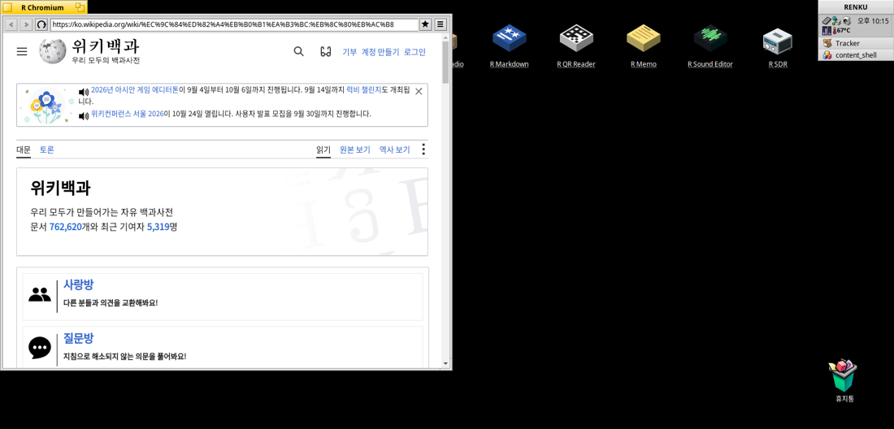
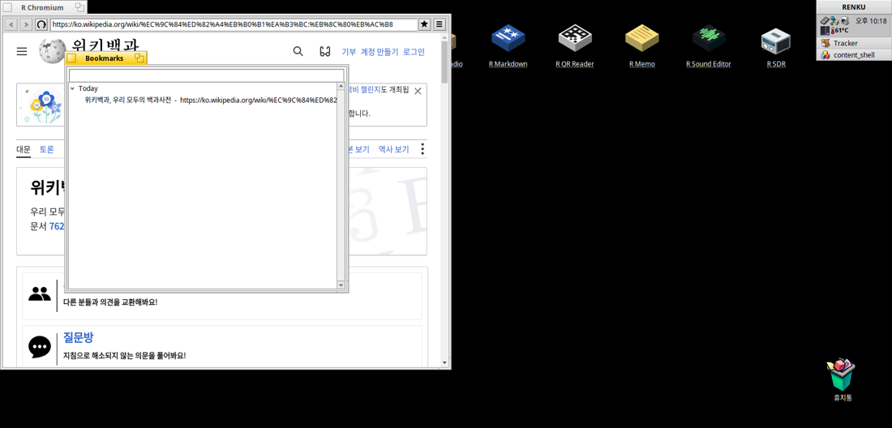

# R Chromium (x86)

[English](README.md) | [日本語](README.ja.md) | **Italiano** | [한국어](README.ko.md)

Un browser web basato su Chromium per Haiku a 32 bit (i386), costruito sul
sistema di finestre nativo di Haiku, senza Qt. Renderizza siti moderni con
JavaScript (google.com, news.naver.com, news.google.co.kr), ha una barra degli
strumenti nativa con pulsanti Indietro / Avanti / Ricarica a sole icone e un
campo indirizzo, conserva segnalibri raggruppati per data e ricercabili, e si
installa sul Desktop con l'icona blu di Chromium.

Questo file e' la guida all'installazione per l'utente finale. La compilazione
dai sorgenti, le note sul porting e tutto il resto per gli sviluppatori si
trovano in [`AGENTS.md`](AGENTS.md).






## Requisiti

- Haiku su x86 a 32 bit (testato su un Sony VAIO P: Intel Atom Z520, 2 GB di
  RAM).
- I font standard di Haiku (`NotoSans*` e `NotoSansCJKjp-VF.otf` in
  `/boot/system/data/fonts`). L'hangul viene renderizzato tramite il font CJK.
- Una build di R Chromium (il binario `content_shell` con `content_shell.pak`,
  `icudtl.dat` e `locales/` accanto). Se disponi dell'albero di build di questo
  repository e' gia' presente; altrimenti compilala come descritto in
  [`AGENTS.md`](AGENTS.md).

## Installazione

Sulla macchina Haiku, da un checkout di questo repository, esegui
l'installer in un passo:

```sh
sh install.sh
```

Tutto qui. Predispone il file fontconfig che manca ad Haiku, verifica il
binario del browser (riparandolo se il linker di questa macchina lo ha
danneggiato), copia R Chromium in `/boot/home/RChromium/` e mette sul Desktop
il lanciatore **R Chromium** con l'icona blu di Chromium.

Se la tua build si trova in un percorso diverso da quello predefinito, passa la
sua directory:

```sh
sh install.sh /path/to/dir/with/content_shell
```

(Produrre quella build dai sorgenti e' un lavoro separato e molto piu' lungo --
vedi [`AGENTS.md`](AGENTS.md). L'installer installa un binario gia'
compilato.)

## Esecuzione

Fai doppio clic su **R Chromium** sul Desktop. Apre Google; digita un indirizzo
nel campo in alto e premi Invio -- un semplice host come `news.naver.com`
diventa `https://news.naver.com/`.

Da una shell:

```sh
"/boot/home/Desktop/R Chromium" https://news.naver.com/
```

## Utilizzo

- **Indietro / Avanti / Ricarica** sono i tre pulsanti a icona sulla sinistra.
  Il pulsante Ricarica diventa Interrompi mentre una pagina si sta caricando.
- **Segnalibri**: la stella (★) aggiunge la pagina corrente ai segnalibri;
  l'elenco (≡) apre la finestra Segnalibri, raggruppata per data (Oggi, Ieri,
  poi le date) con un campo di ricerca che filtra per titolo e URL mentre
  digiti. Fai doppio clic su una voce per aprirla. Aggiungere di nuovo una
  pagina la sposta in Oggi invece di duplicarla. I segnalibri sono salvati nel
  file di testo `~/config/settings/RChromium/bookmarks`, una riga
  `<secondi unix> <url> <titolo>` per segnalibro (separati da tabulazione),
  quindi sopravvivono alle reinstallazioni e possono essere modificati o
  salvati a mano.

## Limiti noti

- **Lo storage web non persiste tra un avvio e l'altro.** Cookie, localStorage
  e login ai siti durano una sola sessione. E' voluto (il browser tiene lo
  storage in memoria); i segnalibri non ne sono influenzati.
- **Le pagine pesanti sono lente sull'Atom.** news.naver.com si carica in
  1,5-2,5 s; news.google.co.kr richiede 6-8 s perche' il suo JavaScript e'
  limitato dalla CPU sul core a 1,33 GHz. E' l'hardware, non un bug.
- Nessuna accelerazione hardware: tutto e' renderizzato via software (Haiku
  non ha GL utilizzabile da Chromium), per questo il lanciatore passa
  `--disable-gpu`.
- Questo e' un port non ufficiale di Chromium 87. Non riceve gli aggiornamenti
  di sicurezza upstream secondo il calendario di Chromium; non usarlo per
  account sensibili.

## Risoluzione dei problemi

- **L'installer dice "embedded blob verification FAILED -- not installing".**
  Il binario indicato e' l'output di un link danneggiato (il linker di questa
  macchina puo' corrompere parte di V8). Installa invece da una build
  verificata -- `/boot/home/content_shell.last-good` lo e' sempre -- oppure
  ricompila con lo script di link verificato (`AGENTS.md`).
- **Il testo non appare / il browser si chiude appena una pagina mostra del
  testo.** `/boot/home/rchromium-fonts.conf` manca o non e' leggibile. Riesegui
  l'installer, oppure copia a mano `assets/rchromium-fonts.conf` in quel
  percorso.
- **La pagina resta vuota subito dopo l'avvio.** Assicurati di averlo avviato
  dal lanciatore sul Desktop o con i flag del lanciatore;
  `--disable-gpu-compositing` in particolare e' obbligatorio su questo backend.
- **Verifica che sia privo di Qt:** `readelf -d /boot/home/RChromium/content_shell | grep NEEDED`
  elenca `libbe.so` e simili e nessuna `libQt5*`.

## Dichiarazione sull'uso dell'IA

Questo programma e' stato scritto con Claude.
