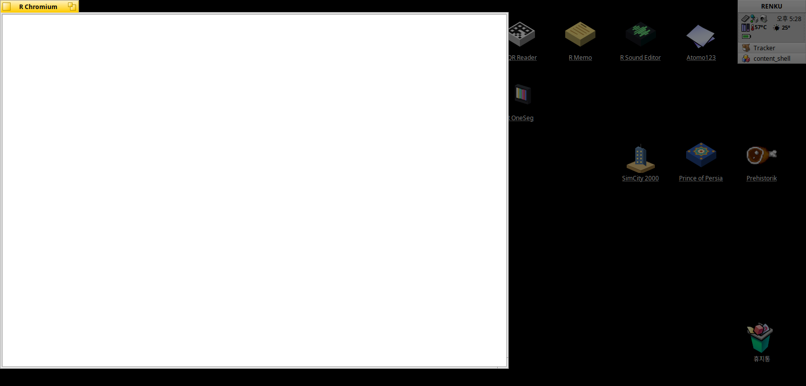
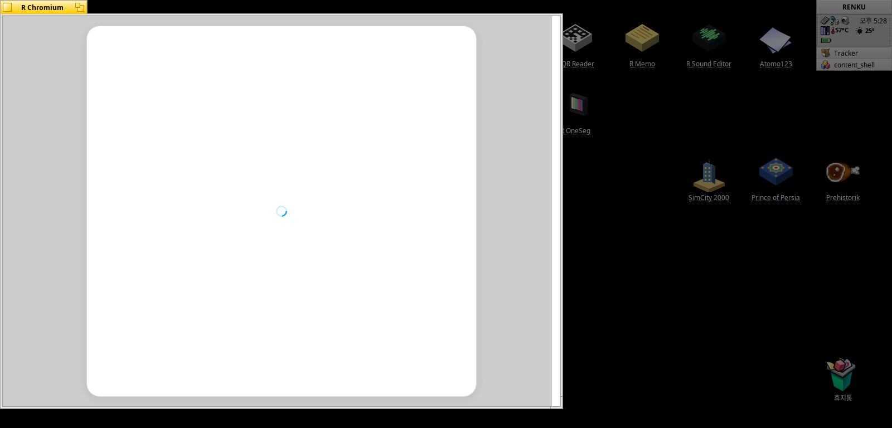
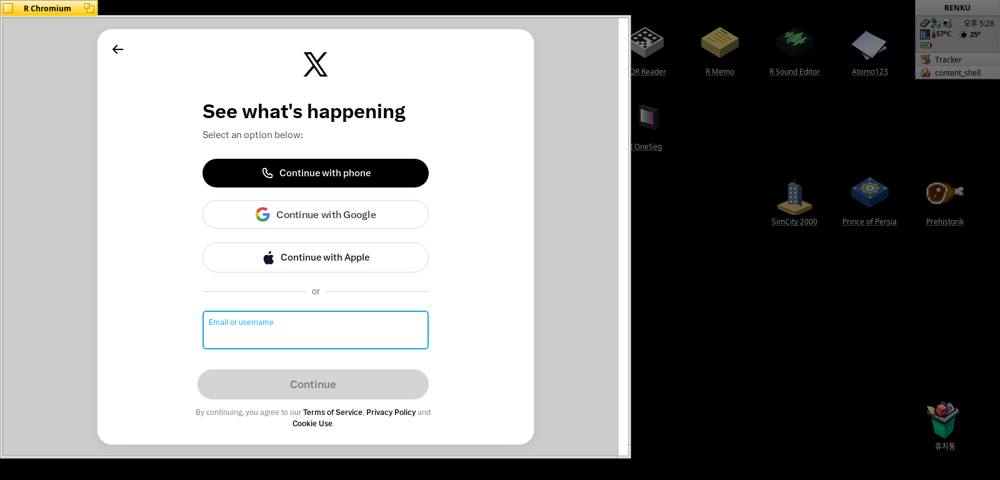

# Chromium 114 port (x86, Qt-free)

A continuation of `chromium108_port/`, not a restart. The scripts and the
Haiku source files carry over; what does not carry over is where every patch
anchors, because 114 moved the code around.

## Why 114 and not 110

108 runs on this machine -- it builds, it links, Haiku's loader accepts it, a
window opens, text renders, TLS works, and **top-level await runs**, which is
what the whole port was for. What it does not do is render x.com, and the
reason is that x.com now asks for JavaScript newer than 108:

	TypeError: n.filter(...).map(...).toSorted is not a function
	  at abs.twimg.com/x-web/x-web/assets/locale-SttZuWL1.js

`Array.prototype.toSorted` is ES2023 and shipped in Chrome 110. V8 10.8
already has it, behind `--harmony-change-array-by-copy`, and turning that on
made `[].toSorted` appear -- and the page still did not mount, so there is
more behind it.

110 would buy exactly that one feature. The cost of moving is the same
whatever the target, because the work is re-anchoring ~242 patches, so the
target should be the highest version the constraints allow:

| constraint | where it bites |
| --- | --- |
| Atom Z520 is 32-bit only | not a problem: V8 keeps its ia32 backend |
| built with gcc, not clang | gets worse with every milestone |
| no Rust toolchain for Haiku x86 | `enable_rust = false` is the default **through 114**; from 119 skia's `bridge_rust_side` makes Rust impossible to switch off |

So 114 is the last milestone where Rust is off by default, and that is the
line this port stops at while it is still a gcc build.

## What carries over

| | |
| --- | --- |
| `port/port-target-guards.py` | 66 gn edits |
| `port/port-haiku-platform.py` | 163 source edits |
| `port/port-compile-fixes.py` | 8 edits |
| `port/port-os-detection.py` | 6 edits |
| `port/port-fd0-workaround.py` | the close(0) workaround, written after 114 |
| `port/port-datapipe-size.py` | 2 MB data pipes are too big for a 32-bit process |
| `port/port-hid-haiku.py` | a HidService, because there being none is fatal |
| `port/port-shell-chrome.py` | the native toolbar's caller, and the install button |
| `files/` | 39 whole files this port adds |

`port-fd0-workaround.py` is new and is not a carry-over: the block it installs
was applied by hand during the fd-0 hunt on 108 and never written down, so a
fresh tree did not get it. Run it after `port-haiku-platform.py`; it replaces
its own block rather than editing around one, so it is safe on a tree that
already has a hand-applied version.

Every edit carries its own "already applied" test and prints
`PATTERN NOT FOUND` when its anchor is gone, so the first run against 114 is
itself the worklist.

## What is already known to need looking at

- the gn args: some were renamed or removed between 108 and 114
- `v8_snapshot_toolchain` still needs a 32-bit mksnapshot; the i686 Linux
  cross toolchain and qemu arrangement should carry over unchanged
- the Ozone/BeAPI backend, which moved once already from 87 to 108
- `K0002` (Haiku's libnetwork closing fd 0) is a system bug, not a Chromium
  one, and applies here too

## It builds, it links, it runs (2026-09-27)

	content_shell   275 MB, ELF32 i386
	ninja exit=0, failed edges 0

And on renku, first try:

	[RCH] OzonePlatformHaiku::InitializeUI
	[RCH] CreatePlatformWindow called
	[RCH] HaikuWindow ctor bounds=800x600
	[RCH] HaikuWindow::Show inactive=0
	DevTools listening on ws://127.0.0.1:47956/...

	title    = top-level await works
	body     = top-level await works | toSorted: 1,2,3
	UA       = Mozilla/5.0 (Haiku; Haiku BePC) ... Chrome/114.0.5735.199
	toSorted = present

## It runs x.com, and R Twitter runs on it (2026-09-28)

Three changes turned the 114 build from an engine that renders x.com into one
an installed web app can be built on.

**The window's name.** Stock content_shell with `toolkit_views = false` has no
browser chrome and never pushes a page title down to the platform window, so
the name a `BWindow` is born with is the name it keeps -- "R Chromium", for
every app. `haiku_beapi_views.cc` now reads `RCH_APP_NAME` in the constructor,
and `HaikuWindow::SetTitle()` honours it as well for whatever path might call
it later. `RCH_NO_TOOLBAR` needs nothing: `AttachBrowserChrome()` is compiled
but nothing calls it, because its caller lived in the 87 overlay's
`shell_platform_delegate_aura.cc`.

**A profile on disk.** content_shell leaves the network context entirely in
memory -- no `file_paths`, no `http_cache_directory` -- so a sign-in lasts
exactly as long as the window and every launch refetches the bundle. The port
now fills both from `--data-path`, the way the 87 port filled 87's flatter
`cookie_path` and `http_cache_path`. In 114 the file names moved into a
`NetworkContextFilePaths` struct, which has to be created before it can be
filled, and `restore_old_session_cookies`/`persist_session_cookies` are still
required or the file exists and session cookies are still dropped on exit.

Verified on renku: set a cookie, wait for the store's ~30 s commit timer, kill
the browser, start it again -- the cookie is back. (The first attempt killed
it after 5 s and came back negative, which was the timer, not the store.)
114 does not force the off-the-record context 87 needs, so `Local Storage`,
`Session Storage` and `Code Cache` land on disk too, and an 11.9 MB `Cache`
directory did not crash anything.

**The fd-0 workaround, quietly.** Haiku's `res_ndestroy()` closing fd 0 (see
`haiku_kernel_patches/K0002`) reaches 114 as it reached 108. It no longer
breaks a page load: `scoped_file.cc` stops a close of fd 0, 1 or 2 being
fatal, and with the *stock* system libnetwork 24 of 25 x.com loads finished
inside 90 s. The one that did not showed zero fd-0 events and no crash, so it
was not that bug. The probe that found the bug now needs `RCH_FD0_PROBE=1`;
it used to print several ERROR lines per page load.

The four things that each took days on 108 -- the loader refusing the
image over DF_STATIC_TLS, the renderer dying on a snapshot built by a
64-bit mksnapshot, the window never being shown, and Haiku's libnetwork
closing standard input -- all passed on the first run here, because
their answers came along in the port scripts. That is what the 108 work
bought.

`Array.prototype.toSorted` is present without a flag, which is what 110
shipped and what 108 could not do.

## x.com gets further and still does not render

	ready     = complete
	URL       = https://x.com/i/jf/onboarding/web?...&mode=login
	title     = X - The Everything App / X
	nodes     = 74
	exceptions = 0
	resources = 250, none with a 4xx or 5xx

250 resources arrive -- entry-client, rolldown-runtime, i18n,
sentry-filter, authorize, react -- and nothing throws. The body is

	SCRIPT[0]  DIV[0, sr-only]  DIV[4 children]

and that last div is `id="loading-x-anim-0"`, the X logo spinner. So the
app boots, renders its loading state, and stops there. 108 never got
past the server-sent shell; this is further in and a different failure.

The window stays white, so the spinner in the DOM is not reaching the
screen either. Whether the app is waiting on something or the compositor
is not presenting is the next thing to find out, and those are different
problems.

## Three walls on the way to x.com (2026-09-28)

None of them was in this port's own code. All three were Chromium doing
the right thing everywhere except here, because Haiku was missing from a
list or getting a default that does not fit.

### 424 requests against a limit of 256

x.com's app fetches a module per route -- 424 of them at once. 247 came
back `net::ERR_INSUFFICIENT_RESOURCES` and the app sat on its loading
spinner waiting for code that was never going to arrive. No exception,
no failed HTTP status: silence.

Haiku starts a team with `RLIMIT_NOFILE` at 256 and allows 8192. Every
socket is a descriptor. Chromium already raises this, in
`BrowserMainLoop::PostCreateThreads`, and the comment above the call
could have been written for this machine -- "the default limit on Apple
is low (256), so bump it up". The call sits inside
`#if IS_APPLE || IS_LINUX || IS_CHROMEOS || IS_ANDROID`.

### A null video capture factory

With the modules arriving, the app ran its fingerprinting script and
asked `navigator.mediaDevices.enumerateDevices()` what cameras exist.
`CreatePlatformSpecificVideoCaptureDeviceFactory()` ends in

	#else
	  NOTIMPLEMENTED();
	  return nullptr;

and `VideoCaptureSystemImpl::GetDeviceInfosAsync()` calls through it
without checking. iOS answers the same question with the fake factory,
which reports no devices; "no camera" is true here anyway. Haiku has a
media_kit with video input, so this is a stub with a real answer behind
it, not a permanent one.

### A stack that was never big enough

Then the renderer died in `Builtins_IncHandler`, which looks like a V8
bug and is not one. From the crash report:

	pthread_19057_stack   0x70401000..0x70446000   276 KB
	faulting esp          0x70405040               16 KB above the bottom

Haiku gives a pthread 256 KB. V8 assumes about 984 KB and lets
JavaScript recurse until it reaches that. x.com's code is deep enough to
find the difference. `GetDefaultThreadStackSize()` in this port returned
0 -- "whatever pthreads gives you" -- under a comment claiming Haiku
grows it to 16 MB on demand. That is true of the main thread's stack and
not of a pthread's. It returns 4 MB now.

DOM nodes went 74 -> 290, the crash is gone, and the window shows the
rounded white card and the spinner instead of nothing.

## x.com renders (2026-09-28)

The X mark, "See what's happening", the phone, Google and Apple buttons,
the email field with its focus ring, Continue, and the terms links. The
whole sign-in screen.

The spinner was not a fourth wall. DOM nodes went 290 -> 461 while I was
looking at it, 168 of them inside the dialog, and IndexedDB opened when
asked. Nothing was stuck: a 1.33 GHz Atom was working through x.com's
JavaScript, and it needed a few more minutes than I had given it. Worth
recording, because three real walls in a row makes the fourth pause look
like another one.

This is what the port was for. The app that Chromium 87 answers with

	SyntaxError: Unexpected reserved word

runs on Haiku x86.

## Four days' worth of walls in one afternoon (2026-09-28)

R Twitter on the 114 build failed four different ways on the same page. They
looked alike from the outside -- a white window, or a window that vanished --
and none of them was the same bug.

**The white window: 2 MB data pipes.** `network::URLLoader` creates one mojo
data pipe per response, sized by
`GetDataPipeDefaultAllocationSize(kLargerSizeIfPossible)`, which is 2 MB on
any machine reporting more than 512 MB of RAM. A data pipe is a shared memory
region: a descriptor pair and a Haiku area in a 32-bit address space that
already holds a 275 MB binary. x.com's Vite build fetches on the order of a
hundred ES modules at once, so the burst asks for 200 MB, and on a 2 GB machine
the allocations start failing. `CreateDataPipe()` failing is reported as
`ERR_INSUFFICIENT_RESOURCES` and nothing else -- the request had already
succeeded, so a net log has no failed request in it, and upstream logs nothing
at the failure. Haiku joins ChromeOS on the 512 KB default, and the failure now
says so in the log.

**The machine going down: a kernel bug the smaller pipes found.** See
`haiku_kernel_patches/K0003`. An ordinary `mmap()` panicked the kernel through
an unsigned underflow in `VMUserAddressSpace::_InsertAreaSlot()`. Worth saying
plainly: the 512 KB change is what exposed it. At 2 MB the allocation failed
earlier and more cleanly; at 512 KB more mappings succeed, the address space
fragments, and the reserved-area fallback that holds the bug gets reached.

**`udp_socket_posix.cc` FATAL: a stale library, not a bug.** K0002's fd-0
problem was fixed in Haiku on 2026-09-03 -- and the test machine's
`lib/x86/libnetwork.so` was built on 2026-08-15. The primary-architecture
`lib/libnetwork.so` had the fix; only the secondary did not, and the secondary
is the one a gcc13 Chromium loads. Rebuilding `haiku_x86` was the whole fix.
**K0002's patch is obsolete**: upstream put `kq`/`resfd` and the closes that
use them inside `#ifndef __HAIKU__`, so the members no longer exist to
initialise.

**The crash on sign-in: no HidService.** `HidService::Create()` returns
nullptr on a platform it does not know, and `HidManagerImpl`'s constructor
follows a `DCHECK` -- compiled out of a release build -- with
`AddObserver()` on that null pointer. x.com asks for the HID device list
because a passkey is a HID device. The fault address moved between runs
(0x30, then 0x2208000), which is what an offset into a null `this` looks
like. Fuchsia answers this with a stub that finds nothing; so does Haiku now.

The trace came from Haiku's own `debug_server`, not from Chromium: there is no
`backtrace()` here, so Chromium's handler prints `[end of stack trace]` and
nothing else. `--disable-in-process-stack-traces` hands the signal to
`debug_server`, which with `default_action report` writes a full report to the
Desktop.

With all four fixed, entering a handle and pressing Continue reaches the
password or passkey step, and the machine stays up.

## The toolbar, and installing a web app (2026-09-28)

Everything the native toolbar is made of was already here --
`haiku_port/ozone/haiku_beapi_views.cc` has back, forward, reload, the address
field, bookmarks, the install button and the icon scaling that gives an
installed app the site's own icon. Nothing called any of it. The caller lived
in the 87 overlay's `shell_platform_delegate_aura.cc`, and this port started
from the stock one, so 114 came up as a window with no chrome at all.

`files/content/shell/browser/shell_platform_delegate_aura.cc` is that caller,
ported. What changed between 87 and 114:

| 87 | 114 |
| --- | --- |
| `WebContents::GetManifest()` | gone; `ManifestManagerHost::GetOrCreateForPage()` |
| `blink::Manifest` | `blink::mojom::Manifest`, with `blink::IsEmptyManifest()` |
| `manifest.icons[i]` is a struct | still a struct -- typemapped, so `.src` and not `->src` |
| `base::ThreadTaskRunnerHandle::Get()` | `base::SingleThreadTaskRunner::GetCurrentDefault()` |
| `base::TimeDelta::FromSeconds(n)` | `base::Seconds(n)` |
| delegate made the `display::Screen` | `ShellPlatformDataAura` makes it, through `ScopedScreenOzone` |
| `RenderViewReady()` | `MainFrameCreated()` |

The Screen is the one that cost a run: 87's `ShellPlatformDataAura` did not
make one and the delegate had to, 114's does, and constructing a second bare
`ScreenOzone` -- which never gets its `Initialize()` called -- SEGVs at 0x0
before the first window appears.

`ManifestManagerHost` is a layer violation and a deliberate one.
`content/shell/DEPS` allows `+content/public` only, because the shell is meant
to be the canonical embedder. 87 did not need the exception; the API it used
was public and was removed. The port adds `+content/browser/manifest` with
that reason written next to it.

Measured on renku, x.com:

    [RCH] AttachBrowserChrome widget=1 inset=30
    [RCH] manifest page=https://x.com/ url=https://x.com/manifest.json
          installable=1 name="X" display=3 icons=4
    [RCH] installed "X" -> /boot/home/config/non-packaged/apps/X/X (deskbar: listed)
    [RCH] icon 512x512 -> /boot/home/config/non-packaged/apps/X/X: set

`RCH_INSTALL_AFTER=<seconds>` presses the button on a timer, which is how that
was tested: the machine is a laptop reached over ssh and a feature that can
only be tested by a person standing at it will not be tested.
